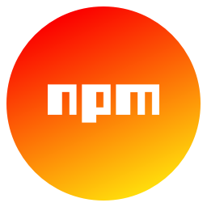
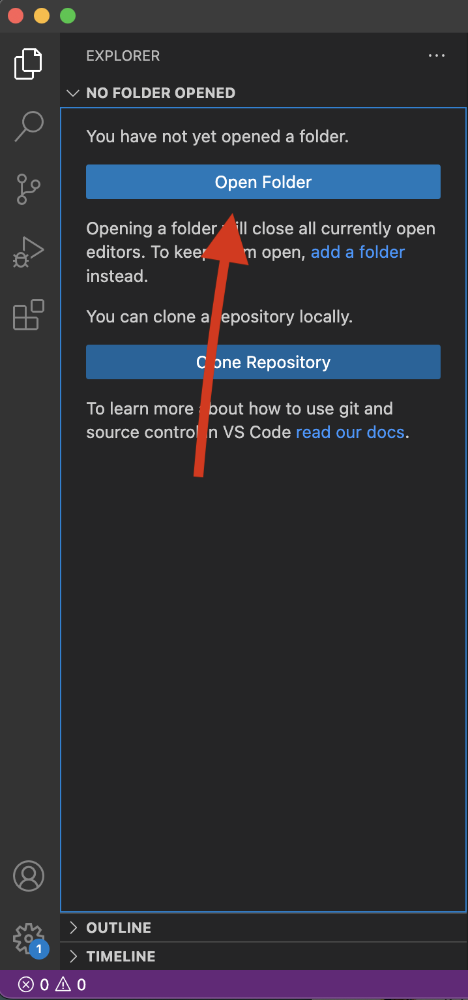
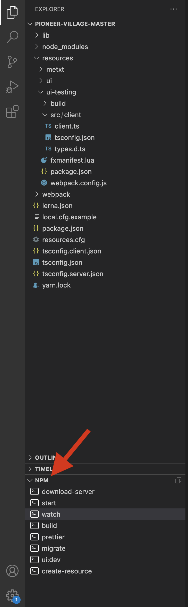
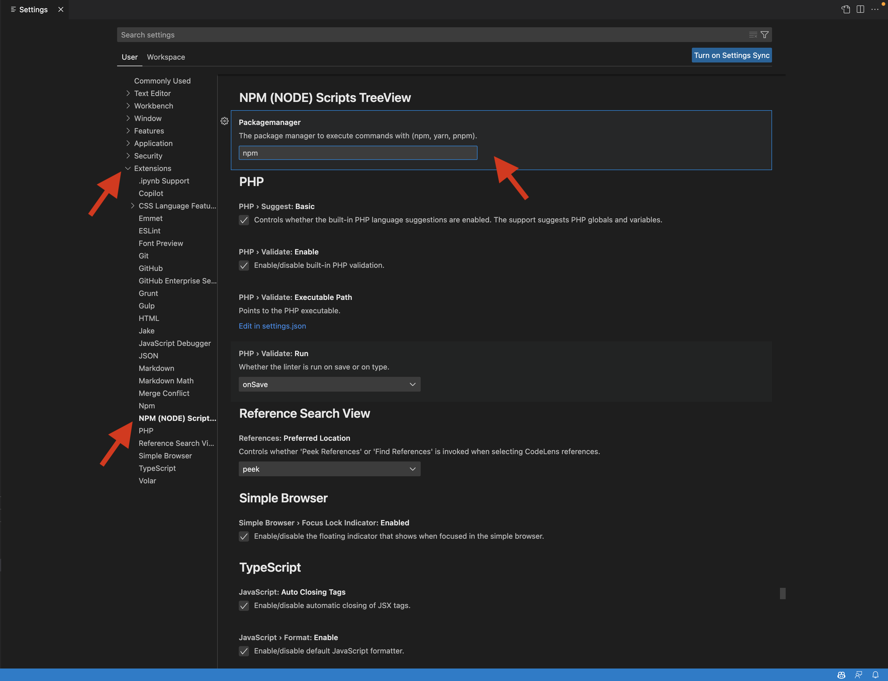

<h1 align="center">
   
    
   
   
  NPM Scripts Menu
   
   
</h1>

<h4 align="center">A VSCode extension that allows you to quickly execute your package.json scripts</h4>

## Basic Usage

> Here are some image that serve as a guide to the extension.

First, in-order to make use of the tree view or rather to get it to show up. You'll need to open a workspace folder.

Then to use it, expand the "npm" menu as shown at the bottom of the project explorer. You can click the command names to execute them using your set package manager.

To change the package manager the npm menu uses to execute commands. Navigate to Settings > Extensions > NPM (NODE) Scripts TreeView > Packagemanager

https://code.visualstudio.com/api/working-with-extensions/publishing-extension
